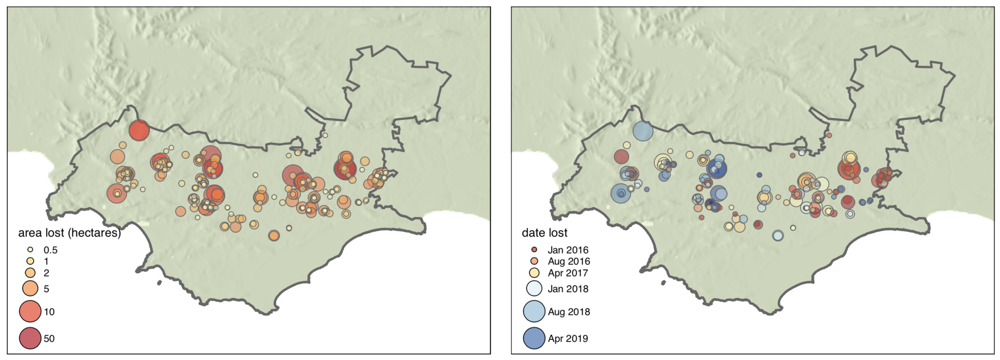

## Locating and dating land cover change events in the Renosterveld, a Critically Endangered shrubland ecosystem

## _Glenn Moncrieff_

### SAEON fynbos node

This repo contains code and data to reproduce results from:
__link to paper forthcoming__

Some input data has not been shared due to its sensitive nature. R code will recreate figures included in the analysis. Python code runs supervised classification using Google Earth Engine. Please run Python code in Google Colab.

